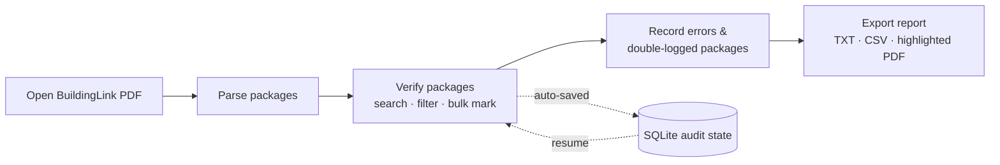

# BuildingLink Package Audit

A desktop application that turns BuildingLink Event Log PDF exports into a fast,
structured package‑auditing workflow for residential concierge and property
management teams.

Instead of marking up printed audit sheets and writing summaries by hand,
auditors open an export, verify packages with a single click, record exceptions
in spreadsheet‑style tables, and generate a standardized audit report
automatically.

---

## Why

Package audits were traditionally done on paper:

- Print the BuildingLink package report
- Mark verified packages by hand
- Write discrepancies and double‑logged packages on the side
- Re‑type everything into a summary

That process is slow, repetitive, and easy to get wrong. This tool removes the
transcription work by capturing audit observations directly as structured data.

---

## Features

**PDF processing**
- Parse BuildingLink Event Log PDFs
- Extract unit, resident, package, tower, timestamp, and tracking last‑four

**Audit workflow**
- One‑click verification with row highlighting
- Live search across unit, resident, package, tracking, and tower
- Keyboard-first unit lookup: type, use Up/Down, and press Enter to mark a row; focus returns to search
- "Unchecked only" filter
- Bulk *Mark All Visible* / *Unmark All Visible* (respect the active search/filter)
- Progress is saved automatically and resumes when the same PDF is reopened

**Phone scanner (local or remote, both free)**
- Use **Local Phone Scanner** on trusted same-device Wi-Fi with no internet dependency
- Use **Remote Phone Scanner** across public/guest networks and VPNs through a temporary Cloudflare HTTPS address
- Pair a phone browser using a temporary six-digit code or QR code
- Capture one tracking barcode at a time; no resident-name or unit OCR is performed
- See live audited/remaining totals, alert counts, and desktop connection state on the phone
- Tap **Scan package**, take the picture, and the phone automatically resizes and submits it
- Decode barcodes locally on the desktop with ZXing; no slow OCR or cloud recognition service is involved
- Require an exact full-tracking-number match—never fuzzy matching, names, units, or last-four alone
- Show the audit's logged unit on the phone and mark it present only after explicit confirmation
- Log reliable tracking barcodes absent from the audit as `Not logged`
- Detect duplicate tracking across units, create alerts, preserve full tracking values, and support undo

**Manual report sections**
- *Package Errors* — `Unit | Location | Carrier | Tracking | Last 4 | Note`
- *Double Logged Packages* — `Unit | Location | Carrier | Tracking | Last 4`
- Spreadsheet‑style editing with dropdowns, tab navigation, and automatic blank rows

**Exports**
- Audit report (`.txt`)
- Spreadsheet-safe raw data (`.csv`)
- Highlighted copy of the source PDF

---

## Tech stack

- **Python** 3.10+
- **PySide6** — desktop UI
- **PyMuPDF** — PDF parsing and highlighting
- **SQLite** — local audit‑state persistence (standard library)

---

## Project structure

```
package-audit/
├── main.py                 # Entry point
├── pyproject.toml          # Metadata, dependencies, tooling config
├── app/
│   ├── constants.py        # Locations, carriers, paths, defaults
│   ├── models.py           # Dataclasses + value normalization
│   ├── parser.py           # BuildingLink PDF parsing
│   ├── database.py         # SQLite persistence layer
│   ├── diagnostics.py      # Private rotating crash diagnostics
│   ├── audit_report.py     # Plain-text report generation
│   ├── export_pdf.py       # Highlighted PDF export
│   ├── export_utils.py     # Safe CSV cells + atomic private exports
│   ├── delegates.py        # Table cell editors (dropdowns)
│   ├── scanner_matching.py # Exact tracking-number lookup
│   ├── scanner_server.py   # Paired local/remote phone web app
│   ├── scanner_tunnel.py   # Optional temporary Cloudflare HTTPS tunnel
│   ├── scanner_vision.py   # Fast local barcode decoding
│   ├── scanner_ui.py       # Desktop pairing dialog
│   ├── theme.py            # Qt stylesheet
│   └── main_window.py      # Main window and application wiring
├── tests/                  # Regression and smoke-test suite
├── data/                   # Put source PDFs here (local)
└── exports/                # Generated reports (local)
```

---

## Getting started

This project uses [uv](https://docs.astral.sh/uv/).

```bash
# Install dependencies into a virtual environment
uv sync

# Launch the application
uv run python main.py

# Or use the installed console entry point
uv run package-audit
```

Barcode scanning is included in the Python environment and packaged application;
there is no separate OCR program to install.

Remote scanning needs the free `cloudflared` utility. On macOS, install it once with
`brew install cloudflared`. Local scanning does not need it.

For a complete terminal walkthrough, phone-pairing steps, and connection troubleshooting, see
[TERMINAL_USAGE.md](TERMINAL_USAGE.md).

### Development

```bash
uv run pytest        # run the test suite
uv run ruff check .  # lint
uv run ruff format --check .
uv run bandit -q -r app main.py
uv run pip-audit
uv run python main.py --export-smoke
uv run python main.py --scanner-smoke
uv run python main.py --remote-scanner-smoke # optional: needs cloudflared + internet
uv run python main.py --ui-smoke
```

### Build a standalone macOS app

```bash
uv run pyinstaller package-audit.spec --clean -y
# Output: dist/Package Audit.app (double-clickable, no Python required)
```

---

## Workflow



1. **Open** a BuildingLink Event Log PDF.
2. **Verify** packages by clicking a row. Use search and *Unchecked only* to
   focus, and the bulk actions to clear large groups quickly.
3. **Record** any package errors and double‑logged packages in their tabs.
4. **Export** the audit report, CSV, or a highlighted PDF.

### Phone scanner workflow

1. Open an audit PDF on the desktop.
2. Click **Local Phone Scanner** when both devices can reach each other on trusted Wi-Fi. Click
   **Remote Phone Scanner** on public/guest Wi-Fi, when VPNs must remain enabled, or when the devices are on
   different networks. Remote mode only requires both devices to have internet access.
3. Scan the displayed QR code, or enter the shown URL and pairing code.
   The desktop dialog confirms when the phone is connected and can copy the address when manual entry is easier.
4. Tap **Scan package**, frame one tracking barcode, take the picture, and accept the phone's camera preview.
   The image is resized and submitted automatically—there is no app-level Submit step. **Existing photo** is a
   fallback for an image already in the photo library.
5. The phone shows the exact unit recorded for that tracking number. Check that unit against the label, then tap
   **Confirm unit …**. Only that confirmation marks the desktop audit row present.
6. A reliable tracking barcode absent from the audit is logged in Package Errors as `Not logged`. Duplicate
   tracking produces a Double Logged row and orange alert. An unreadable or multi-label image asks for a rescan.

Both modes require a temporary pairing code and use a signed browser session plus CSRF checks. Local mode binds
to the private network and needs no internet service. Remote mode binds the scanner itself to Mac loopback only,
then `cloudflared` makes an outbound connection to a random temporary `trycloudflare.com` HTTPS address. It is
free, needs no Cloudflare account, and closes when **Stop Scanner** is clicked. The app checks that the address
is reachable before displaying it and retries once if Cloudflare issues a bad temporary hostname. Photos are
decoded in memory on the desktop and are not saved by Package Audit.

Remote-mode traffic—including barcode photos—passes through Cloudflare because Cloudflare terminates the HTTPS
connection before forwarding it to this Mac. Use Local mode when keeping all traffic on a trusted LAN is more
important. Quick Tunnels are intended for temporary use and have no uptime guarantee; they are not a permanent
hosted service.

If Local mode cannot connect because of VPN routing or Wi-Fi client isolation, stop it and use Remote mode while
leaving both VPNs enabled. If Remote mode cannot start, run `cloudflared --version`, verify the Mac has internet
access, and restart the scanner. The phone disables new scans while disconnected and offers a direct retry or
re-pair action instead of silently continuing with stale state.

Audit state and newly exported files are created with private user-only permissions on platforms that support
POSIX permission bits. The `data/` and `exports/` directory contents are ignored by Git because PDFs, reports,
and CSV files may contain resident information. SQLite state remains local and is not encrypted at rest; use
the operating system's disk encryption and account protections on production workstations. A small rotating
diagnostic log is stored at `~/.package_audit/package-audit.log` with user-only permissions where supported;
it records failures and file paths, but the application does not intentionally log parsed resident data.

The pairing code expires after 15 minutes; an already paired phone remains connected until the scanner stops
or a different PDF is loaded. macOS may ask whether Python can accept incoming network connections the first
time Local mode starts. Allow it only on a trusted private network.

### Keyboard shortcuts

In the Audit tab:

| Shortcut | Action |
| --- | --- |
| Type in search | Filter by unit, resident, tracking, package, or tower |
| `Down` / `Up` from search | Move into the first / last visible result |
| `Down` / `Up` in results | Move between rows |
| `Enter` | Mark/unmark the selected row and return to search |
| `Enter` with one search result | Mark/unmark it directly and stay in search |
| `Ctrl+A` | Mark all visible |
| `Ctrl+Shift+A` | Unmark all visible |

Standard text selection (`Ctrl+A`) still works in the search box and entry tables.

### Reference values

| Locations | Carriers |
| --- | --- |
| SHELF, BIN, BB, CG, UG, ALPHA, FCR | USPS, UPS, FEDEX, AMZ, ONTRAC, DHL, PKG, KEY, FOOD, RX |

---

## Report format

The exported `.txt` report has three sections:

```text
PACKAGE AUDIT REPORT
06/15/2026 08:07 PM
Source: Event log _ BuildingLink.pdf

==================================================
1. PICKED UP BUT NOT CLOSED OUT
==================================================

0207S | 5193
3804S | 9823

==================================================
2. PACKAGE ERRORS
==================================================

1701S | BIN | ONTRAC |  | 6651 | wrong unit
9901S |  | PKG | 1Z000ZZ00000000001 | 0001 | Not logged

==================================================
3. DOUBLE LOGGED PACKAGES
==================================================

0201S | BIN | AMZ |  | 5561
1802S |  | UPS | 1Z999AA10123456784 | 6784
```

- **Section 1** is generated from packages left unchecked during the audit.
- **Sections 2 and 3** come from the manual entry tables and automatic scanner records. Their columns are
  `Unit | Location | Carrier | Tracking | Last 4` plus the Package Errors note.

---

## Audit state management

Audit progress is stored in a local SQLite database keyed by a hash of the PDF
contents (`~/.package_audit/audit_state.sqlite3`). Reopening the same export
restores checked rows and manual entries automatically.

- **Clear Current Audit** — removes checked rows, package errors, double‑logged rows,
  scanner events, and alerts for the loaded PDF.
- **Clear Manual Sections** — removes only the package errors and double‑logged
  rows, keeping package verification intact.

---

## Release status

**v0.6 (current)** — fast tracking-only phone scanning, exact audit lookup,
explicit unit confirmation, automatic image submission, and keyboard-first desktop
auditing, while preserving Not logged/duplicate records, alerts, undo, and exports.

**v0.5** — local phone QR/barcode/OCR scanner, confidence review, automatic
Not logged and duplicate records, alerts, undo, and adaptive matching.

**v0.4** — complete manual audit workflow: parsing, verification, search/filter,
bulk actions, manual report sections, persistence, and exports.

The remaining distribution work is platform trust and release infrastructure:
Developer ID signing/notarization for macOS and native Windows artifact validation
through the included GitHub Actions workflow. Neither requires changing the audit
or scanner data model.
