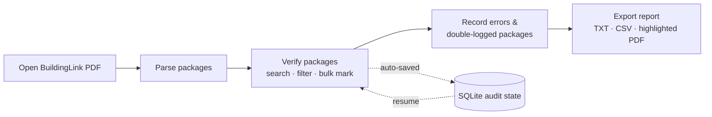

# BuildingLink Package Audit

A desktop application that turns BuildingLink Event Log PDF exports into a fast,
structured package‑auditing workflow for residential concierge and property
management teams.

Instead of marking up printed audit sheets and writing summaries by hand,
auditors open an export, verify packages with a single click, record exceptions
in spreadsheet‑style tables, and generate a standardized audit report
automatically.

---

## Why

Package audits were traditionally done on paper:

- Print the BuildingLink package report
- Mark verified packages by hand
- Write discrepancies and double‑logged packages on the side
- Re‑type everything into a summary

That process is slow, repetitive, and easy to get wrong. This tool removes the
transcription work by capturing audit observations directly as structured data.

---

## Features

**PDF processing**
- Parse BuildingLink Event Log PDFs
- Extract unit, resident, package, tower, timestamp, and tracking last‑four

**Audit workflow**
- One‑click verification with row highlighting
- Live search across unit, resident, package, tracking, and tower
- "Unchecked only" filter
- Bulk *Mark All Visible* / *Unmark All Visible* (respect the active search/filter)
- Progress is saved automatically and resumes when the same PDF is reopened

**Phone scanner (local and free)**
- Pair a phone browser over the same Wi‑Fi using a temporary six-digit code or QR code
- Scan QR codes, 1D/2D barcodes, or photograph a printed package label
- Decode barcodes locally with ZXing and printed text locally with Tesseract OCR
- Match only tracking number, unit, and any listed resident surname; carrier is never a match signal
- Automatically mark confident matches, ask "Do you mean?" for uncertain matches, and log reliable
  barcode no-matches as `Not logged`
- Detect duplicate tracking across units, create alerts, preserve full tracking values, and support undo
- Learn confidence weights and recurring OCR corrections from confirmations and rejections

**Manual report sections**
- *Package Errors* — `Unit | Location | Carrier | Last 4 | Note`
- *Double Logged Packages* — `Unit | Location | Carrier | Last 4`
- Spreadsheet‑style editing with dropdowns, tab navigation, auto blank rows, and
  bulk paste import

**Exports**
- Audit report (`.txt`)
- Raw data (`.csv`)
- Highlighted copy of the source PDF

---

## Tech stack

- **Python** 3.10+
- **PySide6** — desktop UI
- **PyMuPDF** — PDF parsing and highlighting
- **SQLite** — local audit‑state persistence (standard library)

---

## Project structure

```
package-audit/
├── main.py                 # Entry point
├── pyproject.toml          # Metadata, dependencies, tooling config
├── app/
│   ├── constants.py        # Locations, carriers, paths, defaults
│   ├── models.py           # Dataclasses + value normalization
│   ├── parser.py           # BuildingLink PDF parsing
│   ├── database.py         # SQLite persistence layer
│   ├── audit_report.py     # Plain-text report generation
│   ├── export_pdf.py       # Highlighted PDF export
│   ├── delegates.py        # Table cell editors (dropdowns)
│   ├── theme.py            # Qt stylesheet
│   └── main_window.py      # Main window and application wiring
├── tests/                  # Pytest suite (models, reporting, database)
├── data/                   # Put source PDFs here (local)
└── exports/                # Generated reports (local)
```

---

## Getting started

This project uses [uv](https://docs.astral.sh/uv/).

```bash
# Install dependencies into a virtual environment
uv sync

# One-time local OCR installation on macOS
brew install tesseract

# Launch the application
uv run python main.py
```

### Development

```bash
uv run pytest        # run the test suite
uv run ruff check .  # lint
```

### Build a standalone macOS app

```bash
uv run pyinstaller package-audit.spec --clean -y
# Output: dist/Package Audit.app  (~146 MB, double-clickable, no Python required)
```

---

## Workflow



1. **Open** a BuildingLink Event Log PDF.
2. **Verify** packages by clicking a row. Use search and *Unchecked only* to
   focus, and the bulk actions to clear large groups quickly.
3. **Record** any package errors and double‑logged packages in their tabs.
4. **Export** the audit report, CSV, or a highlighted PDF.

### Phone scanner workflow

1. Open an audit PDF on the desktop.
2. Click **Start Phone Scanner**.
3. Scan the displayed QR code with a phone on the same Wi‑Fi, or enter the shown URL and pairing code.
4. Tap **Scan package** and photograph the label. The image is processed in memory and is not saved.
5. High-confidence matches are marked in the desktop audit. Medium-confidence results ask for a choice.
  Reliable barcodes absent from the audit are logged in Package Errors as `Not logged`.
6. Duplicate tracking produces a Double Logged row and an orange alert. Red means not logged, yellow means
  review, and the ordinary audit highlight remains green.

The phone scanner binds to the local network only, requires a temporary pairing code, uses a signed browser
session plus CSRF checks, and does not require internet access or a paid service. Keep the phone and computer
on a trusted private Wi‑Fi network. If OCR is unavailable, barcode and QR scanning still work and the pairing
screen reports the missing OCR capability.

The pairing code expires after 15 minutes; an already paired phone remains connected until the scanner stops
or a different PDF is loaded. macOS may ask whether Python can accept incoming network connections the first
time the scanner starts. Allow it only on a trusted private network.

### Keyboard shortcuts

When the audit table is focused:

| Shortcut | Action |
| --- | --- |
| `Ctrl+A` | Mark all visible |
| `Ctrl+Shift+A` | Unmark all visible |

Standard text selection (`Ctrl+A`) still works in the search box and entry tables.

### Reference values

| Locations | Carriers |
| --- | --- |
| SHELF, BIN, BB, CG, UG, ALPHA, FCR | USPS, UPS, FEDEX, AMZ, ONTRAC, DHL, PKG, KEY, FOOD, RX |

---

## Report format

The exported `.txt` report has three sections:

```text
PACKAGE AUDIT REPORT
06/15/2026 08:07 PM
Source: Event log _ BuildingLink.pdf

==================================================
1. PICKED UP BUT NOT CLOSED OUT
==================================================

0207S | 5193
3804S | 9823

==================================================
2. PACKAGE ERRORS
==================================================

1701S | BIN | ONTRAC |  | 6651 | wrong unit
9901S |  | PKG | 1Z000ZZ00000000001 | 0001 | Not logged

==================================================
3. DOUBLE LOGGED PACKAGES
==================================================

0201S | BIN | AMZ |  | 5561
1802S |  | UPS | 1Z999AA10123456784 | 6784
```

- **Section 1** is generated from packages left unchecked during the audit.
- **Sections 2 and 3** come from the manual entry tables and automatic scanner records. Their columns are
  `Unit | Location | Carrier | Tracking | Last 4` plus the Package Errors note.

---

## Audit state management

Audit progress is stored in a local SQLite database keyed by a hash of the PDF
contents (`~/.package_audit/audit_state.sqlite3`). Reopening the same export
restores checked rows and manual entries automatically.

- **Clear Current Audit** — removes checked rows, package errors, double‑logged rows,
  scanner events, and alerts for the loaded PDF.
- **Clear Manual Sections** — removes only the package errors and double‑logged
  rows, keeping package verification intact.

---

## Roadmap

**v0.5 (current)** — local phone QR/barcode/OCR scanner, confidence review,
automatic Not logged and duplicate records, alerts, undo, and adaptive matching,
while preserving the complete manual workflow and exports.

**v0.4** — complete manual audit workflow: parsing, verification, search/filter,
bulk actions, manual report sections, persistence, and exports.

**v1.0 (planned)** — additional real-label validation, threshold tuning from
feedback history, UI polish, and packaging for non-technical users.
